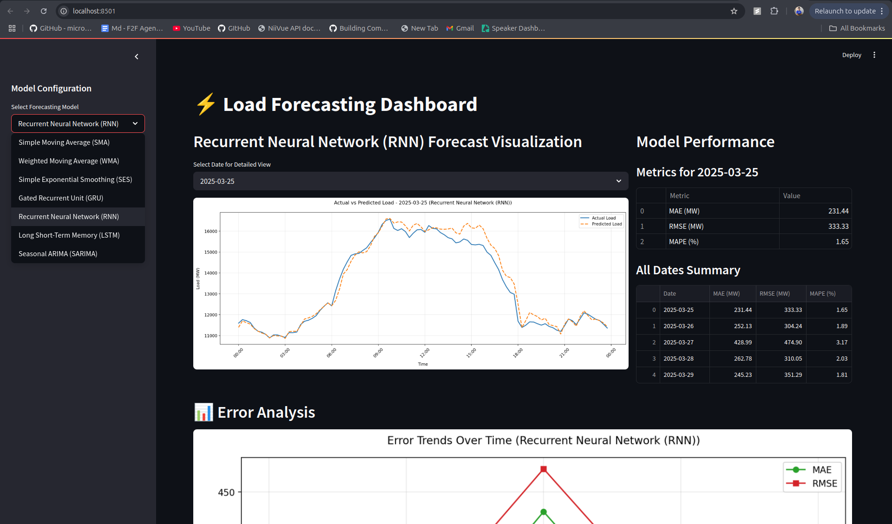

# Load Forecasting

## Project Overview

This project implements and compares seven different time series forecasting models for predicting electricity load consumption 5 days ahead at a 15-minute resolution. It serves as an exploration into the effectiveness of various statistical and machine learning approaches for this critical task in power systems management.

## Models Implemented

Descriptions of the models implemented in this project:

### Traditional Models

1.  **Simple Moving Average (SMA)**
    * **Concept:** Calculates the average of the 'n' most recent observations, assigning equal weight to each. Smooths out noise but lags behind trends.
    * **Project Implementation:** A "block-wise" variation was used. Instead of a rolling window, it averaged the load value for the *same 15-minute interval* across a window of preceding days (e.g., averaging 9:00 AM load from the last 10 days to predict 9:00 AM load tomorrow), aiming to capture daily periodicity.

2.  **Weighted Moving Average (WMA)**
    * **Concept:** Assigns different weights to past observations, typically giving more importance to recent data points, making it more responsive than SMA.
    * **Project Implementation:** Used a 5-period window. Instead of predefined weights (like linear decay), the weights were *optimized* using a gradient descent algorithm based on the training data's forecast error. Load data was MinMax scaled before applying WMA and predictions were denormalized. Employed a recursive prediction strategy.

3.  **Simple Exponential Smoothing (SES)**
    * **Concept:** Assigns exponentially decreasing weights to past observations – the most recent data gets the highest weight. Primarily suited for data without clear trends or seasonality.
    * **Project Implementation:** Applied "block-wise", similar to SMA. It forecasted a specific 15-minute block using a weighted average of the load from the same block in the preceding 5 days, but used *fixed exponential weights* derived from a predefined decay factor (0.5), rather than estimating the optimal smoothing parameter (alpha). Recursive prediction was used.

### Advanced Models

4.  **Recurrent Neural Network (RNN)**
    * **Concept:** A type of neural network with internal loops (recurrent connections) allowing information from previous steps to persist (a form of memory), making it suitable for sequential data. Simple RNNs can struggle with long-range dependencies.
    * **Project Implementation:** Used a Keras `Sequential` model with stacked `SimpleRNN` layers (64, 32, 16 units, `tanh` activation), followed by `Dense` layers. Input features included time-based data, lags, rolling statistics, and cyclic features over a 24-step window. Features and target were scaled using `MinMaxScaler`.

5.  **Gated Recurrent Unit (GRU)**
    * **Concept:** An advanced RNN variant with gating mechanisms (update and reset gates) that control information flow. Designed to better capture long-range dependencies and mitigate the vanishing gradient problem, often with fewer parameters than LSTMs.
    * **Project Implementation:** Keras `Sequential` model with stacked `GRU` layers (64, 32 units) and `Dropout` regularization. Engineered features included time-based data, cyclic features, specific lags (1h and 24h), and rolling means over longer windows (3h, 6h). *Note:* Input was reshaped with `time_steps=1`, heavily relying on the engineered features rather than sequence processing within the GRU. Features and target were scaled.

6.  **Long Short-Term Memory (LSTM)**
    * **Concept:** A sophisticated RNN type featuring a memory cell and three gates (input, forget, output) to precisely control information retention and flow. Highly effective at learning long-range dependencies in sequences.
    * **Project Implementation:** Keras `Sequential` model with a single `LSTM` layer (40 units) employing L2 regularization and a high `Dropout` rate (0.4). Followed by a `Dense` output layer. Trained with the Adam optimizer using a very low learning rate. Input features were comprehensive, including time-based, cyclic, short-term lags, a daily lag (lag_96), and 1-hour rolling statistics. Features and target were scaled.

7.  **Seasonal Autoregressive Integrated Moving Average (S-ARIMA)**
    * **Concept:** A statistical model extending ARIMA by incorporating seasonal components. It explicitly models linear dependencies on past values (AR), past errors (MA), and their seasonal counterparts, after applying differencing (I) to achieve stationarity.
    * **Project Implementation:** Implemented using `statsmodels.tsa.statespace.sarimax`. The model order was determined as SARIMA(1, 0, 1)(1, 0, 1)96, indicating non-seasonal AR(1) and MA(1) terms, seasonal SAR(1) and SMA(1) terms with a daily seasonality (m=96 for 15-min data), and no differencing required (d=0, D=0) based on ADF tests of the fitted data. Operates directly on the univariate load time series.

## Dataset

* **Type:** Electricity load data at 15-minute intervals.
* **Period Used:** 2025-03-01 to 2025-03-29
    * **Training Data:** 2025-03-01 00:00:00 to 2025-03-24 23:45:00
    * **Testing Data (Forecast Horizon):** 2025-03-25 00:00:00 to 2025-03-29 23:45:00
* **Source:** [Specify the source of your data, e.g., Public dataset, Utility provider, Simulated data]. Mention if the data files are included in the repository (e.g., under `data/`) or need to be obtained separately.
* **Note on Test Data Features:** For the advanced neural network models (RNN, GRU, LSTM), input features during the test period (Mar 25-29) were generated using simulated outputs from the traditional models, as described in the project report (Section 3.4).

## Methodology Highlights

* **Traditional Models:** Implemented with specific variations (block-wise SMA/SES, optimized WMA).
* **Advanced NN Models (RNN, GRU, LSTM):**
    * **Feature Engineering:** Employed various time-based features (hour, day of week), cyclic features (sine/cosine transforms), lag features (recent and seasonal), and rolling window statistics (mean, std dev). Specific feature sets varied per model (see detailed descriptions above).
    * **Preprocessing:** Used `MinMaxScaler` for scaling input features and the target variable.
    * **Input Reshaping:** Data was reshaped into a 3D format `[samples, time_steps, features]` suitable for Keras/TensorFlow sequential models, using a sliding window approach.
    * **Architectures:** Utilized Keras `Sequential` API to build recurrent and dense layers. Regularization techniques like Dropout and L2 were employed.
* **S-ARIMA:**
    * Implemented using `statsmodels.tsa.statespace.sarimax`.
    * Operated directly on the univariate load series.
    * Stationarity checked using ADF test.
    * Model order: SARIMA(1, 0, 1)(1, 0, 1)96.
* **Evaluation:** Model performance was internally evaluated using MAE, RMSE, and MAPE metrics (though detailed results are omitted here per README focus).

## Technologies Used

* **Language:** Python 3.x
* **Core Libraries:**
    * Pandas: Data manipulation, time series handling.
    * NumPy: Numerical operations.
    * Scikit-learn: `MinMaxScaler`, potentially metrics (`mean_absolute_error`, `mean_squared_error`, `mean_absolute_percentage_error`).
    * TensorFlow / Keras: Building and training RNN, GRU, LSTM models.
    * Statsmodels: Implementing the S-ARIMA model (`SARIMAX`), ADF test.
    * Matplotlib / Seaborn: (Used for generating plots in the report, useful for visualizing results if running notebooks).
    * Jupyter Notebook/Lab: (Optional, if used for development/analysis).
